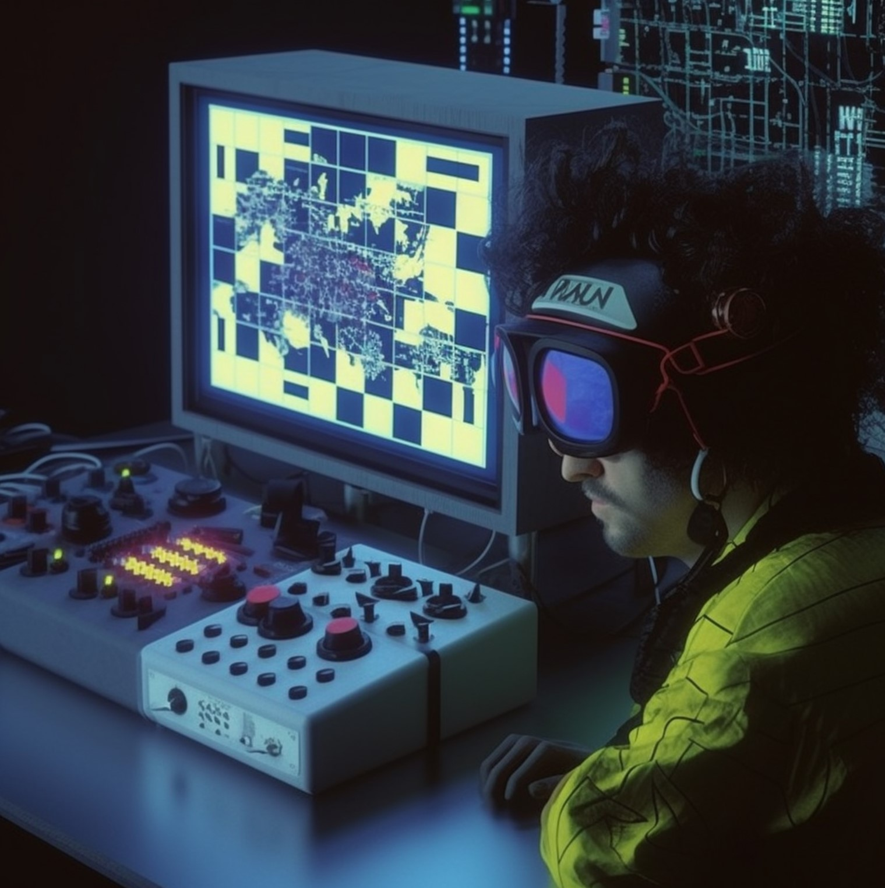

# radionics
Online Radionics for everyone



## Build
````shell
 ng build --base-href radionics
````
Always include the copyright. Do not remove it, else it is an infringement of the License.
```qute
Copyright Isuret Polos 2023
```
## Disclaimer
This software is provided "as is" and without any warranty or representation, whether express, implied or statutory. The creator and owner of this software and the information does not make any guarantees or claims as to the accuracy, reliability, suitability, availability or completeness of the software or any information contained within it. The creator and owner of this software shall not be liable for any damages or injury, including but not limited to, direct, indirect, incidental, special, consequential or exemplary damages, arising from the use or inability to use the software or any information contained within it. The user assumes full responsibility for using the software and any consequences that may arise from such use. This software is not intended to replace or substitute for any professional medical advice, diagnosis or treatment. The user is advised to seek professional medical advice before using the software for any medical purposes. By using this software, the user agrees to indemnify and hold harmless the creator and owner of the software from any claims, demands, actions or damages arising from the use of the software or any information contained within it.

I do not provide medical health service or any kind of service. This is my own experiment put online. Whoever wants to play with it, you are welcome. Do not use it as replacement for a doctor if you need medical attention. Your health is your own responsibility, not mine!
 
